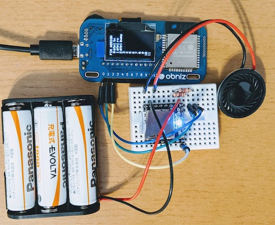

# obniz-dfplayer-mini

Obniz parts for DFPlayer mini mp3 player. 

- obniz.js: https://github.com/obniz/obniz.
- DFPlayer mini: https://wiki.dfrobot.com/DFPlayer_Mini_SKU_DFR0299

See examples/playfolder.js for usage.

Since DFPlayer mini requires heavy output to run, power cannot be supplied from Obniz board. So in the following wiring example, batteries are used to supply power to DFPlayer mini.

